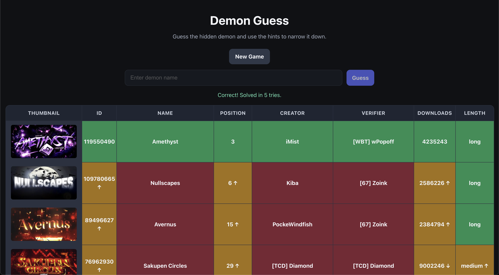

# DemonListdle

## Contents

- [Demo](#demo)
- [Features](#features)
- [Tech stack](#tech-stack)
- [DB structure](#db-structure)
- [Setup](#setup)
- [Data sources](#data-sources)
- [Credits](#credits)
- [AI usage](#ai-usage)


## Demo



This is the interface of the guessing page. You write your guess in the input field and another row is added to the page showing you the hints for your guess. This will give you more information for the second guess. If you are stuck you may visit the pointercrate demonlist website by [clicking here](https://www.pointercrate.com/demonlist/).

## Features

The main feature of this game is the guessing page as shown in the demo.

## Tech stack

- Frontend: React
- Backend: Flask
- Database: MariaDB

## DB structure

### Demons

| key | value|
|------|-----|
| id | int |
| name | str |
| position | int |
| creator | str |
| verifier | str |
| thumbnail | str(link) |
| downloads | int |
| length | int |

## Setup

3. Open new terminal and run ```npm install node```
4. update DB data by running ```node importdata.js```
1. Run the Docker daemon (or Docker desktop)
2. Run ```docker compose up --build```

## Data sources

The data used in the database is imported using the APIs of both pointercrate and the official Geometry Dash servers.

## Credits

- [Pointercrate](https://www.pointercrate.com/) — Demonlist data and API
- [RobTop Games](https://www.robtopgames.com/) — Geometry Dash API
- [Peter](https://github.com/peiterer) — Developer

## AI usage

- Chatgpt helped me create the subheadings and structure for this README file. The contents were written by me

- I have used Chatgpt, Gemeni and GitHub copilot to research syntax.

- I used GitHub copilot in order to create the necesarry docker- and docker-compose files.

- GitHub Copilot was used to generate the frontend UI